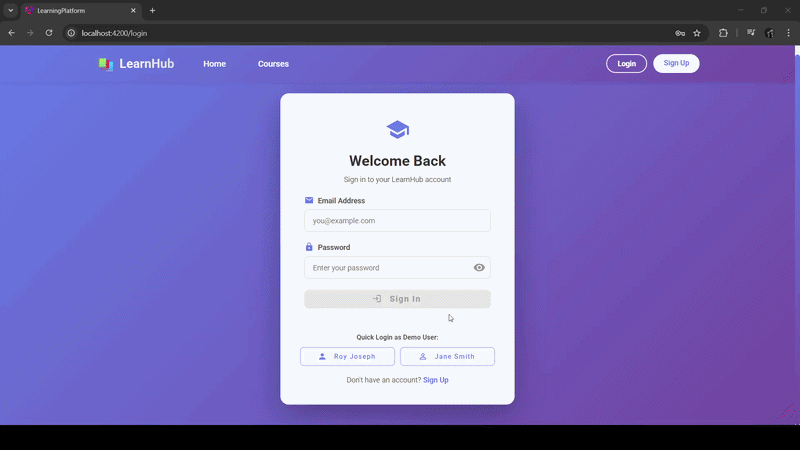

# 📚 LearnHub - Learning and Course Enrollment Platform

A modern, feature-rich learning management platform built with Angular 21. Browse courses, enroll in programs, track your progress, and achieve your learning goals with an intuitive and responsive interface.

## 🚀 Live Preview

**[View Live Demo](https://learning-and-course-enrollment-plat.vercel.app/)** 
---

## 📸 Screenshots



## ✨ Features

### For Students
- **Course Catalog** - Browse through a wide variety of courses with advanced filtering by category, level, and price
- **Detailed Course Pages** - View comprehensive course information including syllabus, instructor details, reviews, and FAQs
- **Student Dashboard** - Track enrolled courses, monitor progress, and view completion statistics
- **Progress Tracking** - Real-time progress updates with visual progress bars and completion percentages
- **Course Reviews** - Read student testimonials and ratings before enrolling

### Course Management
- **Multiple Course Levels** - Beginner, Intermediate, and Advanced courses
- **Rich Course Details** - Instructor profiles, learning outcomes, duration, and pricing
- **Interactive FAQ Section** - Expandable/collapsible frequently asked questions
- **Enrollment System** - Simple course enrollment with form validation
- **Certificate Tracking** - Monitor certificate eligibility and achievements

### User Experience
- **Responsive Design** - Fully optimized for desktop, tablet, and mobile devices
- **Modern UI** - Clean, gradient-based design with smooth animations
- **User Profiles** - Personalized dashboard with profile management
- **Image Support** - Course thumbnails and instructor profile pictures

### Authentication & Security
- **Login & Register** - Template-driven forms with validation and demo user quick-fill
- **Auth Guard** - Route protection that redirects unauthenticated users to login with returnUrl support
- **HTTP Error Interceptor** - Global error handling with MatSnackBar notifications for all HTTP failures

### Angular Material UI
- **Material Components** - MatToolbar, MatCard, MatTable, MatDialog, MatProgressBar, MatSnackBar, MatTabs, MatButton, MatIcon
- **Enrollment Dialog** - Confirmation popup via MatDialog after successful enrollment
- **Loading Indicator** - Global `MatProgressBar` during route navigation
- **Themed Notifications** - Success/error snackbar messages across the app

### Custom Pipes & Directives
- **CourseFilterPipe** - Filter courses by category in the template
- **CourseLevelPipe** - Filter courses by difficulty level
- **CourseDurationPipe** - Filter courses by maximum duration
- **HighlightTrendingDirective** - Gold border highlight for trending courses
- **HighlightNewDirective** - Green border highlight for newly added courses

### Observables & HTTP Client
- **HttpClient Integration** - All data fetched from mock JSON files via Angular HttpClient
- **BehaviorSubject Caching** - Reactive state management with RxJS BehaviorSubjects in services
- **Error Handling** - `catchError` with fallback data in CourseService, global interceptor for HTTP errors

---

## 🛠️ Tech Stack

- **Framework**: Angular 21.1.1
- **Language**: TypeScript
- **Styling**: CSS3 with custom animations
- **Routing**: Angular Router with lazy loading
- **State Management**: RxJS Observables
- **Forms**: Angular Reactive Forms
- **UI Library**: Angular Material 21.1.1
- **Animations**: @angular/animations (async)
- **HTTP**: Angular HttpClient with functional interceptors
- **Guards**: Functional CanActivateFn route guards
- **Architecture**: Standalone components (no NgModules)

---

## 📦 Installation

### Prerequisites
- Node.js (v18 or higher)
- npm (v9 or higher)
- Angular CLI 21.1.1

### Setup

1. **Clone the repository**
   ```bash
   git clone https://github.com/abhishanfrancis/Learning-and-Course-Enrollment-Platform.git
   cd learning-platform
   ```

2. **Install dependencies**
   ```bash
   npm install
   ```

3. **Start the development server**
   ```bash
   ng serve
   ```

4. **Open in browser**
   Navigate to `http://localhost:4200/`

---

## 📂 Project Structure

```
learning-platform/
├── src/
│   ├── app/
│   │   ├── components/          # Feature components
│   │   │   ├── course-list/     # Browse courses
│   │   │   ├── course-detail/   # Course information
│   │   │   ├── enroll-form/     # Enrollment form
│   │   │   ├── home/            # Landing page
│   │   │   ├── navbar/          # Navigation bar
│   │   │   └── student-dashboard/ # Student progress
│   │   ├── models/              # TypeScript interfaces
│   │   │   ├── course.model.ts
│   │   │   └── student.model.ts
│   │   ├── services/            # Business logic
│   │   │   ├── course.service.ts
│   │   │   └── student.service.ts
│   │   └── app.routes.ts        # Route configuration
│   ├── assets/                  # Images and static files
│   └── styles.css              # Global styles
└── package.json
```

### New Additions to Project Structure

```
src/app/
├── components/
│   ├── login/                   # Login page (template-driven form)
│   ├── register/                # Registration page (template-driven form)
│   ├── course-reviews/          # Child route: course reviews
│   ├── related-courses/         # Child route: related courses
│   ├── feedback-form/           # Feedback form (reactive form)
│   └── enrollment-dialog/       # MatDialog enrollment confirmation
├── guards/
│   └── auth.guard.ts            # Functional CanActivateFn guard
├── interceptors/
│   └── http-error.interceptor.ts # Functional HttpInterceptorFn
├── pipes/
│   └── course-filter.pipe.ts    # CourseFilter, CourseLevel, CourseDuration pipes
├── directives/
│   └── highlight-course.directive.ts # HighlightTrending, HighlightNew directives
└── services/
    ├── user.service.ts           # Authentication & user management
    └── enrollment.service.ts     # Enrollment operations & progress tracking

public/data/
├── courses.json                 # Mock course data (HttpClient source)
├── students.json                # Mock student/user data
└── enrollments.json             # Mock enrollment records
```

---

## 🎯 Key Pages

### Home Page (`/`)
Welcome page with featured courses and call-to-action buttons

### Courses Page (`/courses`)
- Course grid with filtering options
- Filter by category, level, and price range
- Real-time course count display

### Course Detail Page (`/course/:id`)
- Complete course information
- Detailed syllabus breakdown
- Student reviews and ratings
- FAQ section with expandable answers
- Enrollment call-to-action

### Student Dashboard (`/dashboard`)
- Active courses tab
- Completed courses tab
- Progress tracking
- Quick access to continue learning

### Enrollment Form (`/enroll/:id`)
- Student information collection
- Payment card details
- Form validation

### Login Page (`/login`)
- Template-driven form with email/password validation
- **Demo user quick-fill buttons** (Roy Joseph & Jane Smith)
- Password visibility toggle
- Error banner for invalid credentials
- Redirects to `returnUrl` after success

### Register Page (`/register`)
- Template-driven registration form
- Password strength indicator
- Redirects to login after registration

### Course Reviews (`/course/:id/reviews`)
- Child route under course detail page
- Rating summary with star display
- Individual review cards

### Related Courses (`/course/:id/related`)
- Child route under course detail page
- Courses filtered by same category
- Quick navigation to related course details

### Feedback Form (`/feedback/:id`)
- Reactive form built with FormBuilder & Validators
- Star rating selector
- Protected by AuthGuard

---

## 🎨 Features Showcase

### Advanced Filtering
Filter courses by:
- Category (Web Development, Programming, UI/UX)
- Difficulty Level (Beginner, Intermediate, Advanced)
- Price Range (Dynamic slider)

### Progress Tracking
- Visual progress bars
- Percentage completion
- Last accessed dates
- Certificate status

### Interactive FAQ
- Expandable question panels
- Smooth animations
- Comprehensive course information

### Custom Pipes in Action
- Template-driven filtering using `courseFilter`, `courseLevel`, and `courseDuration` pipes
- Applied directly in `*ngFor` for declarative, reactive filtering
- Pure pipes that re-evaluate only when inputs change

### Custom Directives
- `appHighlightTrending` — Adds a gold border to trending course cards
- `appHighlightNew` — Adds a green border to newly added course cards
- Applied as attribute directives on `<mat-card>` elements

### Angular Material Integration
- `MatDialog` for enrollment confirmation popups
- `MatSnackBar` for success/error toast notifications
- `MatProgressBar` for dashboard progress & navigation loading
- `MatTable` with columns for enrolled courses on dashboard
- `MatTabs`-style navigation for course detail child routes

### Authentication Flow
- Login/Register with template-driven forms
- AuthGuard protects Dashboard, Enrollment, and Feedback routes
- Unauthenticated users redirected to `/login?returnUrl=...`
- Demo user quick-fill buttons for instant testing

### HTTP & Error Handling
- All data loaded via `HttpClient` from `/data/*.json` mock files
- Global `httpErrorInterceptor` catches all HTTP errors
- Error notifications displayed via `MatSnackBar` with status-specific messages
- `CourseService` uses `BehaviorSubject` caching with `catchError` fallback

---

## 🚀 Available Scripts

### Development
```bash
ng serve              # Start dev server
ng serve --open       # Start and open browser
```

### Build
```bash
ng build              # Production build
ng build --watch      # Development build with watch
```

### Code Generation
```bash
ng generate component component-name
ng generate service service-name
ng generate module module-name
```

### Testing
```bash
ng test               # Run unit tests
ng e2e                # Run end-to-end tests
```

---

## 📊 Course Data

Currently includes **6 courses** covering:
- Angular Fundamentals
- Advanced TypeScript
- Reactive Programming with RxJS
- Material Design with Angular
- Full Stack Development
- Web Performance Optimization

---

## 👤 Author

**Abhishan Francis**

- GitHub: [@abhishanfrancis](https://github.com/abhishanfrancis)
- Project: [Learning-and-Course-Enrollment-Platform](https://github.com/abhishanfrancis/Learning-and-Course-Enrollment-Platform)

---

## 📝 License

This project is available for educational and portfolio purposes.

---

## 🤝 Contributing

Contributions, issues, and feature requests are welcome! Feel free to check the issues page.

---

## 🙏 Acknowledgments

- Angular Team for the amazing framework
- Placeholder image services for demo images
- Material Design for UI inspiration

---

## 🔧 New Services

### UserService
- `login(email, password)` — Authenticate against mock student data
- `logout()` — Clear current user session
- `register(student)` — Add new student to the system
- `getCurrentUser$()` — Observable of the currently logged-in user
- `isLoggedIn()` — Synchronous auth check

### EnrollmentService
- `enrollStudent(studentId, courseId)` — Create new enrollment record
- `getStudentEnrollments(studentId)` — Get all enrollments for a student
- `isEnrolled(studentId, courseId)` — Check enrollment status
- `getStudentProgress(studentId, courses)` — Calculate progress across courses
- `updateProgress(enrollmentId, percentage)` — Update course completion

---

## 🔀 Routing Architecture

```
/                     → Home (public)
/courses              → Course List (public)
/course/:id           → Course Detail (public)
  /course/:id/reviews   → Course Reviews (child route)
  /course/:id/related   → Related Courses (child route)
/login                → Login (public)
/register             → Register (public)
/dashboard            → Student Dashboard (🔒 AuthGuard)
/enroll/:id           → Enrollment Form (🔒 AuthGuard)
/feedback/:id         → Feedback Form (🔒 AuthGuard)
```

---

## 🧪 Demo Credentials

| User | Email | Password |
|------|-------|----------|
| Roy Joseph | roy@example.com | password123 |
| Jane Smith | jane@example.com | password456 |

Use the **quick-fill buttons** on the login page to auto-populate credentials.

---

**Made with ❤️ using Angular**
